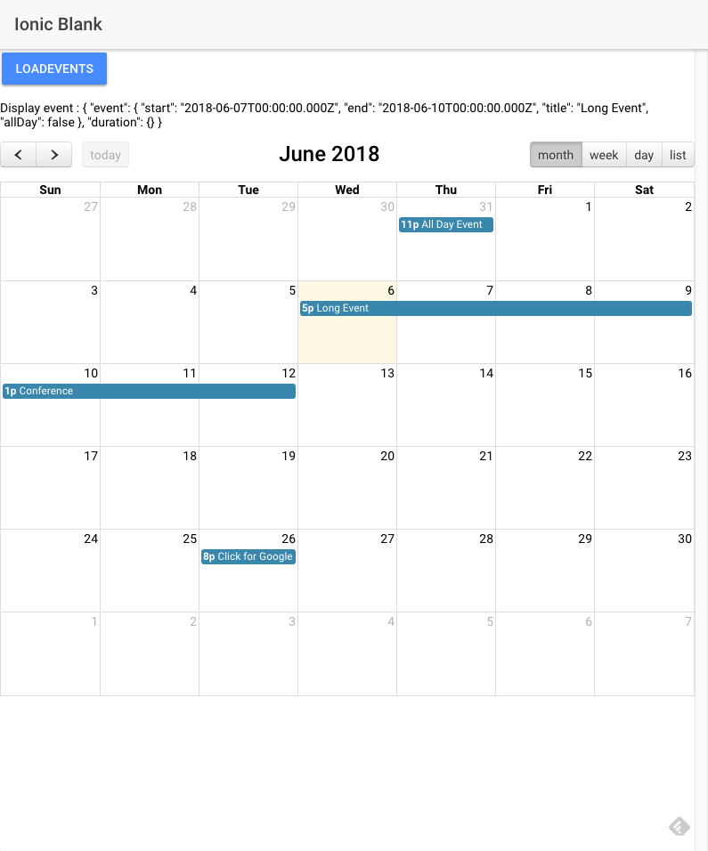

# Ionic3 with ng-fullcalendar (https://www.npmjs.com/package/ng-fullcalendar, https://fullcalendar.io)

## Dependencies

Install the dependencies:
* npm install ng-fullcalendar
* npm install fullcalendar@3.6.1
* npm install

## How to use


* Add the dependencie FullCalendarModule in the app.module.ts

 ```typescript
 import { FullCalendarModule } from 'ng-fullcalendar';
 imports: [
    FullCalendarModule,
    ...
  ],
 ```
* Create a example provider with the data of events: 
  - Example the file "eventService.ts" wich is in the code
  - Add the dependencie in the app.module.ts

  ```typescript
  import { EventSesrvice } from './../providers/eventService';
  providers: [
    EventSesrvice,
    ...
  ]
  ```

* Create custom config to add the css files to the build folder
  - Example of the custom config in the file "copy.config.js", To add the config it add in the package.json 

    ```json
      "config": {
          "ionic_copy": "./config/copy.config.js"
        }
    ```

* Add the import of file css in the app.scss

```css
@import "fullcalendar.min.css";
```





## That's all folks !


